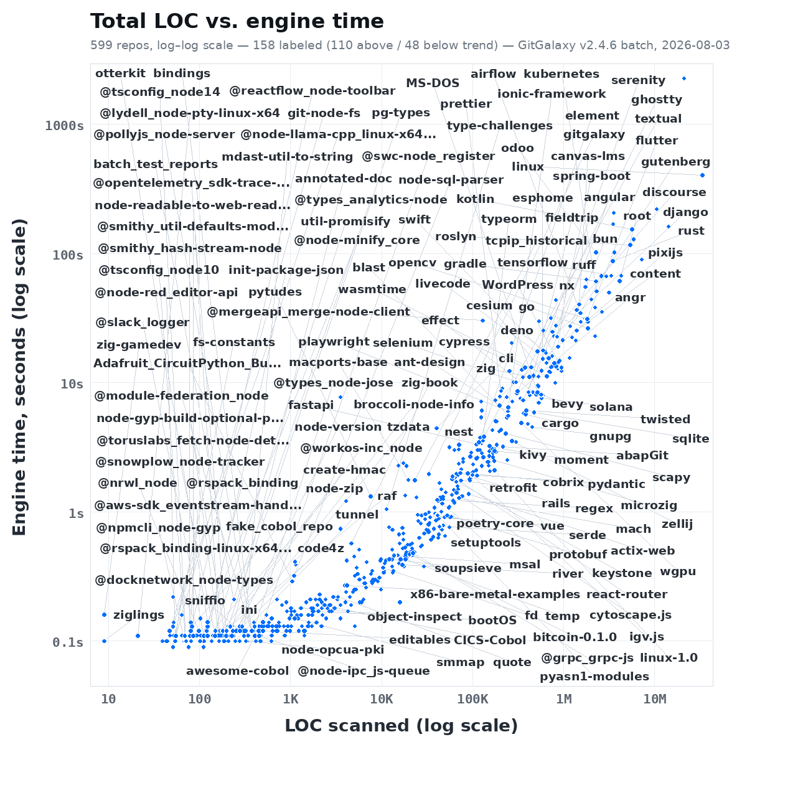
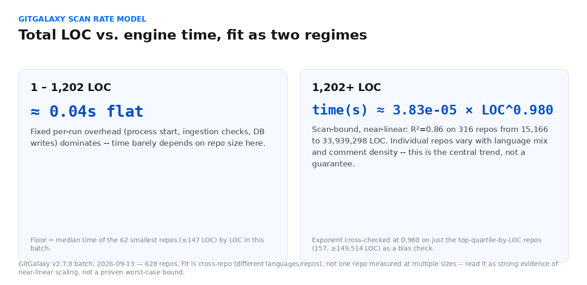

# gitgalaxy-raw-output

## Why This Exists

[GitGalaxy's README](https://github.com/squid-protocol/gitgalaxy) makes claims about scanning
50+ languages, deterministic output, and speed across large, real-world codebases. This repo is
the evidence behind those claims, in the least trustable-by-default form there is: the actual,
unedited output of real scan runs, kept versioned over time. Nothing here is a summary,
sample, or curated highlight — it's every scan batch, as the engine actually produced it.
See [GitGalaxy's "Proof, Not Just Claims" section](https://github.com/squid-protocol/gitgalaxy#proof-not-just-claims)
for how this fits alongside the engine's test suite and the
[language-crucible](https://github.com/squid-protocol/language-crucible) golden-master corpus —
those two prove the engine is *correct* on a curated adversarial corpus; this repo is the
complementary evidence that it also *runs*, at scale, across a much larger set of real,
independently-chosen repositories.

This repo does **not** contain analysis code. Aggregation and population-level analysis
(clustering, the threat classifier, the merged master database, etc.) live in a separate repo,
`gitgalaxy-population-analyses`, which reads its raw inputs from here.

## Layout

One folder per scanner version, each holding the per-repo output bundles flat, matching
gitgalaxy's own `updated_results_*` convention:

```
gitgalaxy-raw-output/
├── v2.4.5/
│   ├── linux_galaxy_audit.json.gz
│   ├── linux_galaxy_master.db.gz
│   └── ...
└── v2.4.6/   (v2.4.6 benchmark artifacts organized per repo directory)
    ├── Apollo-11/
    │   ├── Apollo-11_galaxy_audit.json.gz
    │   ├── Apollo-11_galaxy_master.db.gz
    │   ├── Apollo-11_galaxy_graph.sqlite.gz
    │   ├── Apollo-11_galaxy_sarif.json.gz
    │   ├── Apollo-11_galaxy_sbom.json.gz
    │   ├── Apollo-11_galaxy_gpu.json          (uncompressed)
    │   └── Apollo-11_galaxy_llm.md            (uncompressed)
    └── ... (718 repo directories in this batch)
```

**Why some files are gzipped and others aren't:** `_galaxy_audit.json`, `_galaxy_master.db`,
and `_galaxy_graph.sqlite` can individually exceed GitHub's 100MB per-file push limit
(audit.json alone has hit 1.2GB uncompressed on a single large repo). They also compress
extremely well — gzip alone took a 20.6GB/716-repo batch down to ~2.65GB with zero files left
over 100MB, so no Git LFS is needed. `_galaxy_gpu.json` and `_galaxy_llm.md` are always small
and stay uncompressed for easy inline viewing.

**Sparse checkout note:** this repo's default sparse-checkout only materializes the small,
uncompressed `_galaxy_gpu.json` and `_galaxy_llm.md` files locally, not the full gzipped
artifacts or this README — `git sparse-checkout list` shows the active patterns, and
`git sparse-checkout add <path>` (or `git sparse-checkout disable`) pulls the rest.

## Corpus: What Was Actually Scanned

`corpus/` pins the exact set of source repositories a scan batch was run against, so the input
corpus is reproducible on another machine:

- `corpus/v1/manifest.json` — every repo's name, origin URL, and the exact commit it was scanned at.
- `corpus/setup_corpus.py` — clones every repo in a manifest at its pinned commit (and optionally triggers `--scan`).

```bash
python3 corpus/setup_corpus.py v1 --dest /path/to/gitgalaxy/data --scan --output /path/to/gitgalaxy-raw-output/v2.4.6
```

**Known gap, stated plainly:** `corpus/v1/manifest.json` currently pins 323 repositories, but
the `v2.4.6/` batch archived in this repo contains output for 718 — the batch that produced
these artifacts was run against a larger, ad hoc set that grew past what `v1` captured. That
means `v1` alone doesn't yet reproduce the full `v2.4.6` batch end-to-end; it reproduces a
323-repo subset of it. Tracked in [#1](https://github.com/squid-protocol/gitgalaxy-raw-output/issues/1) —
a `v2` manifest capturing the full current batch is the natural follow-up so this
reproducibility claim covers everything actually in `v2.4.6/`, not just part of it.

## Using This as Proof of Multi-Language Scanning

Every repo directory under `v2.4.6/` corresponds to one real, independently-authored codebase —
not a synthetic test fixture — and its `_galaxy_llm.md` file is a readable, uncompressed
summary of what GitGalaxy extracted from it. To spot-check the "50+ languages" claim yourself:
pick any directory, open its `_galaxy_llm.md`, and compare what it reports against the actual
source at the pinned commit in `corpus/v1/manifest.json` (or the repo's own language, for the
part of the batch `v1` doesn't yet cover). This is meant to be checked, not taken on faith.

## Speed Telemetry



Every repo in the batch, log–log. This always reflects the newest scanner version — it
regenerates automatically on every new batch, nothing here is hand-updated.

**Why not just report an average LOC/s?** Rate depends on repo size, not batch mix — a single
average blends two different regimes into a meaningless number, so it's fit as two instead:



- **Below the knee:** flat, fixed-overhead time — not LOC-dependent
- **Above it:** power-law scan time, near-linear (exponent ≈0.97 — not superlinear)
- Methodology and full-precision numbers: `compute_rate_model()` in
  `tools/generate_speed_telemetry.py`, `speed_charts/latest/rate_model.{json,txt}`

**Generated automatically** by `.github/workflows/speed-telemetry.yml` whenever a new
`v*/batch_scan_master_*.log` is pushed (parsed from the log's own `MISSION COMPLETE` report and
`BATCH ANOMALY & ERROR REPORT`):

- `speed_history.csv` — one row per version, for rate trend across releases
- `v<version>/speed_summary.json` — full per-repo table + anomaly report
- `v<version>/speed_charts/{loc_vs_time,rate_model}.{png,json,txt}` — that version's own charts
- `speed_charts/latest/` — stable copies of the newest version (what's embedded above)

To regenerate by hand (e.g. after editing the parser, or to backfill an older version):

```bash
pip install pillow   # + fonts-dejavu-core, if not already on the system
python tools/generate_speed_telemetry.py v2.4.6   # one version
python tools/generate_speed_telemetry.py --all    # every v*/ folder in the repo
```

The workflow's own commit only touches `speed_history.csv`, `speed_summary.json`, and the chart
PNGs — never `batch_scan_master_*.log` itself — so it can't retrigger its own path filter.
